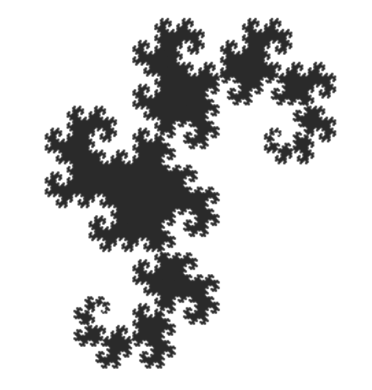
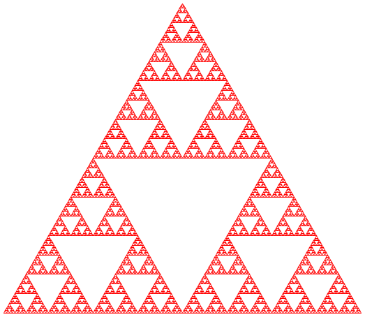
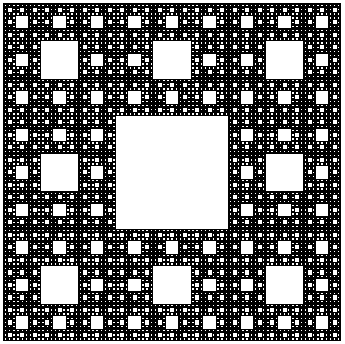

# fractals

Fun with fractals!

#### Dragon Curve
15 iterations

#### Sierpinski's Triangle
9 iterations

#### Sierpinski's Carpet
10 iterations

To-do List
-------
- [ ] Tiling dragon curves
- [ ] Koch Snowflake
- [ ] Mass Center Triangle
- [ ] Levy C Curve
- [ ] Play with coloring
